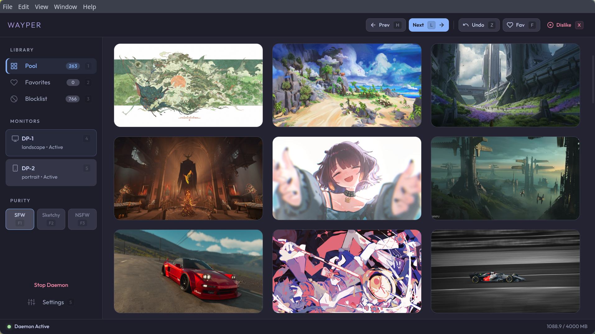

<p align="center">
  
  <h1 align="center">wayper</h1>
  <p align="center">
    The wallpaper manager that learns what you like.<br>
    Wallhaven integration · AI-native · keyboard-driven.
  </p>
  <p align="center">
    <a href="https://yuukidach.github.io/wayper/">Home</a> · <a href="#install">Install</a> · <a href="#gui">GUI</a> · <a href="#cli">CLI</a> · <a href="#mcp">MCP</a> · <a href="#config">Config</a> · <a href="docs/README.zh-CN.md">中文</a>
  </p>
</p>

<p align="center">
  
</p>

## Why wayper?

Most wallpaper tools stop at "set image on desktop." wayper is a full **Wallhaven client** that auto-downloads, curates, and rotates wallpapers — and gets smarter the more you use it.

**What makes it different:**

- **Learns from you** — mark a wallpaper **Dislike** when the model misses it and wayper adds an explicit training label. **Ban** remains a separate exact-image block for wallpapers you are simply tired of.
- **AI-native (MCP)** — built-in [MCP](https://modelcontextprotocol.io/) server. Tell Codex or Claude *"switch to something with mountains"* or *"favorite this one"* — it just works. First wallpaper manager with native AI assistant integration.
- **Keyboard-driven GUI** — every single action has a shortcut. Grid navigation, lightbox, favorites, settings — fully operable without a mouse. Built for power users.

**And the fundamentals:**

- **Wallhaven integration** — auto-downloads based on your search preferences. Syncs favorites and tag blacklist to your Wallhaven account.
- **Smart tag filtering** — excluded tags sync to Wallhaven's cloud blacklist for server-side filtering; overflow tags are sent via URL query; the rest are filtered after metadata fetch. Zero wasted downloads.
- **Auto orientation** — portrait monitors get portrait wallpapers. No sorting needed.
- **Three-tier purity** — SFW, Sketchy, NSFW — independently toggleable, persistent across sessions.
- **Cross-platform** — Windows, macOS, and Linux (Hyprland/Sway). CLI + GUI + MCP.
- **`--json` everywhere** — every command supports machine-readable output.

## Install

### Arch Linux (AUR)

```bash
paru -S wayper     # or: yay -S wayper
```

### Windows

Download the latest Windows installer from [GitHub Releases](https://github.com/yuukidach/wayper/releases/latest), or install from source with Python 3.12+.

```powershell
git clone https://github.com/yuukidach/wayper.git
cd wayper
uv venv
uv pip install -e .
```

### macOS

Download the latest `.dmg` from [GitHub Releases](https://github.com/yuukidach/wayper/releases/latest), or install from source with Python 3.12+.

### From source

```bash
git clone https://github.com/yuukidach/wayper.git
cd wayper
uv venv && uv pip install -e .
uv pip install -e ".[browser]"  # optional: browser cookie extraction for Wallhaven sync
```

## GUI

<p align="center">
  
</p>

`wayper-gui` launches a standalone app for browsing, managing, and controlling your wallpaper collection. Fully operable without a mouse.

- **Browse & preview** — grid view with thumbnail caching, lightbox preview, set wallpaper with Enter
- **Tag search** — search by Wallhaven tags, category, or filename with autocomplete
- **Smart suggestions** — analyzes ban patterns to recommend tags to exclude; co-occurrence mining finds common descriptors across excluded individuals; drill into combo exclusions (e.g., "tattoo + nude") for precise filtering
- **AI analysis** — Codex-powered deep analysis of ban patterns with iterative feedback. Identifies uploader patterns and suggests Wallhaven user blacklist candidates. Click suggested tags to preview matching images
- **Adaptive filtering** — choose `rules`, `model`, or `rules + model` from the always-visible sidebar control. **Review** keeps automatically held downloads and ordinary model recommendations in separate card lanes; manually Dislike any existing pool image the model missed
- **Settings** — configure the download folder, Wallhaven queries, excluded tags/combos, purity, and monitors from the GUI. Changes apply to the running daemon instantly
- **Keyboard-driven** — every action has a shortcut: grid navigation, lightbox, favorites, Dislike, Ban, and undo

**Grid view:**

| Key | Action | Key | Action |
|-----|--------|-----|--------|
| `p` / `v` | Pool / Favorites | `m` / `b` | Model / Blocklist |
| `s` | Settings | `F1` `F2` `F3` | Toggle SFW / Sketchy / NSFW |
| `h` / `l` | Prev / Next wallpaper | `f` | Favorite (focused card or current) |
| `d` | Dislike + teach model | `x` / `Del` | Ban exact image only |
| `u` | Undo last Dislike / Ban | `o` | Open on Wallhaven |
| `/` | Focus search bar | `Esc` | Clear search / Unfocus |
| `Enter` / `Space` | Preview (lightbox) | Arrow keys | Navigate grid |
| `[` / `]` | Blocklist: Recoverable / All | `a` | AI analysis (Blocklist) |
| `g` | Locate current wallpaper | `gg` / `G` | Jump to first / last |
| `1`–`9` | Switch monitor | | |

**Lightbox preview:**

| Key | Action | Key | Action |
|-----|--------|-----|--------|
| `←` / `→` | Previous / Next image (pan when zoomed) | `Enter` | Set as wallpaper |
| `f` | Favorite | `d` | Dislike + teach model |
| `x` / `Del` | Ban exact image only | `a` (Review) | Keep reviewed candidate |
| `o` | Open on Wallhaven | | |
| `Space` / `Esc` | Close lightbox | | |
| Scroll | Zoom at cursor (0.5×–8×) | Drag | Pan when zoomed in |
| `0` | Reset to fit | `+` / `-` | Zoom in / out |
| Double-click | Toggle 100% / fit | | |

## CLI

<p align="center">
  
</p>

```
wayper daemon               # start background rotation + downloads
wayper next                 # next wallpaper (forward history or new random)
wayper prev                 # previous wallpaper from history
wayper fav [--open]         # favorite current wallpaper
wayper unfav                # remove from favorites
wayper dislike              # explicit dislike: teach model, blacklist + switch
wayper ban                  # exact-image block only: blacklist + switch
wayper unban                # undo last dislike or ban
wayper mode                 # toggle sfw↔nsfw (preserves sketchy)
wayper mode sketchy         # toggle sketchy on/off
wayper mode sfw,sketchy     # set exact purity combination
wayper suggest             # frequency-based tag exclusion suggestions
wayper suggest --ai        # AI-powered analysis via Codex CLI
wayper model train         # train the lightweight local metadata ranking model
wayper model score --tags "tag1,tag2"  # explain a local dislike score
wayper model status        # inspect the saved model and recent validation
wayper status               # show current state
wayper-gui                  # GUI app (browse, actions, daemon, settings)
wayper setup                # install .desktop entry (Linux)
wayper --json status        # machine-readable output
```

`wayper model train` reads only local Wallhaven metadata—normalized tags plus
compact color/category/purity context—and never opens image files or inspects
pixels. The base model works with the Python standard library; tag pairs remain
an opt-in experiment (`--max-combos`). For a stronger local text head, install
`uv pip install -e '.[semantic]'`: it uses `BAAI/bge-small-en-v1.5` through
FastEmbed to encode the metadata text only, with a persistent local embedding
cache. The first semantic training run may take longer while that cache is
filled. Before any review decisions exist, an installation may use its older
blacklist/favorite data as a temporary bootstrap. Once a **Review** decision or
manual **Dislike** has been recorded, only explicit Keep/Dislike decisions are
used as new training labels; an ordinary Ban is not silently promoted to one.
The optional semantic head learns related metadata patterns from the same review
examples, without a manually configured person/region rule. A live image that
has never been explicitly kept is treated as a background control, not as proof
that you like it. Wayper reserves the most recent part of each explicit Keep/Dislike
class to learn an accuracy-first Review boundary, weighting precision more than
recall so weak guesses do not create a large manual queue. **Recommended** and
**Auto-held** use that same binary decision: scores below the learned boundary
are omitted, and the page size is only a maximum rather than a target to fill.
Semantic and exact evidence rank the images that already passed the boundary;
rank alone cannot make an image a candidate. Because model hits require a human
decision, a current trained model can filter without passing the separate
high-precision gate used for unattended deletion. Model hits never enter the
blacklist automatically.

The GUI's dedicated **Review** view is the control center for this loop.
The sidebar control chooses `Rules`, `Model`, or `Both` (`Rules + model`) for
new downloads; it does not turn recommendations on or off. The review view has
two explicit lanes: **Auto-held** for downloads quarantined by the model, and
**Recommended** for likely blocks already in the pool. Pending
Auto-held items open first, so an automatic model decision is never buried
behind recommendations. Each lane uses a full-window, horizontally scrolling
card stack: drag or scroll through cards, use the side arrows, and click the
current image (or press `Enter`/`Space`) for the full preview. `A` keeps the
current card; `D` dislikes it (`X`/`Delete` remain compatible in Review). For
Auto-held cards, Keep releases the file into the pool and Dislike sends it to
system trash plus the blacklist. For recommendations, Keep records a positive
correction without moving the file,
while Dislike follows the normal pool-to-trash/blocklist flow and records a
negative training label. The Blocklist view
therefore remains reserved for recoverable/blocked files and tag/uploader
exclusion rules. Feedback is appended to a local JSONL event log (the older JSON log
is still read), and after 10 new events Wayper queues a local full-batch refresh;
`wayper model status` shows the pending count and model schema. The strategy is
stored as `wallhaven.filter_strategy` in TOML and defaults to `rules` for
existing installations.

### Keybindings

**Hyprland:**

```ini
bind = $mod, F9,       exec, wayper ban
bind = $mod CTRL, F9,  exec, wayper dislike
bind = $mod SHIFT, F9, exec, wayper unban
bind = $mod, F10,      exec, wayper fav
bind = $mod SHIFT, F10,exec, wayper unfav
bind = $mod CTRL, F10, exec, wayper fav --open
bind = $mod, F11,      exec, wayper next
bind = $mod SHIFT, F11,exec, wayper prev
bind = $mod, F12,      exec, wayper mode
bind = $mod SHIFT, F12,exec, wayper mode sketchy
exec-once = wayper daemon
```

**AeroSpace (macOS):**

```toml
cmd-shift-n = 'exec-and-forget wayper next'
cmd-shift-b = 'exec-and-forget wayper ban'
cmd-shift-f = 'exec-and-forget wayper fav'
```

## MCP

wayper ships an [MCP](https://modelcontextprotocol.io/) server so AI assistants can control your wallpapers natively.

Use the absolute path to `wayper-mcp`. After installing from source, that is usually `.venv/bin/wayper-mcp`.

**Codex:**

```bash
codex mcp add wayper -- /path/to/wayper/.venv/bin/wayper-mcp
```

Or edit `~/.codex/config.toml`:

```toml
[mcp_servers.wayper]
command = "/path/to/wayper/.venv/bin/wayper-mcp"
```

**Claude Code:**

Add to `~/.claude/.mcp.json`:

```json
{
  "mcpServers": {
    "wayper": {
      "command": "/path/to/wayper/.venv/bin/wayper-mcp"
    }
  }
}
```

Available tools: `status` · `next_wallpaper` · `prev_wallpaper` · `fav` · `unfav` · `dislike` · `ban` · `unban` · `set_mode` · `delete_wallpaper` · `wallpaper_info` · `tag_stats_top` · `tag_stats_lookup` · `tag_stats_combo` · `uploader_stats_lookup`

## Config

Linux/macOS:

```bash
mkdir -p ~/.config/wayper
cp example-config.toml ~/.config/wayper/config.toml
```

Windows:

```powershell
New-Item -ItemType Directory -Force "$env:APPDATA\wayper"
Copy-Item example-config.toml "$env:APPDATA\wayper\config.toml"
```

Set the wallpaper download folder in the GUI Settings view, or edit `download_dir` in [`example-config.toml`](example-config.toml). See that file for all options — API key, proxy, intervals, quota, minimum Wallhaven favorites, transitions, etc. Monitors are auto-detected; the `[[monitors]]` config section is only needed as a fallback when detection fails.

## Requirements

- Python 3.12+
- [Wallhaven API key](https://wallhaven.cc/settings/account)

**Linux:** [awww](https://codeberg.org/LGFae/awww), [Hyprland](https://hyprland.org/)

**macOS:** Python 3.12+, Node.js (for Electron GUI)

**Windows:** Windows 10/11, Python 3.12+, Node.js (for Electron GUI)

## License

[MIT](LICENSE)
